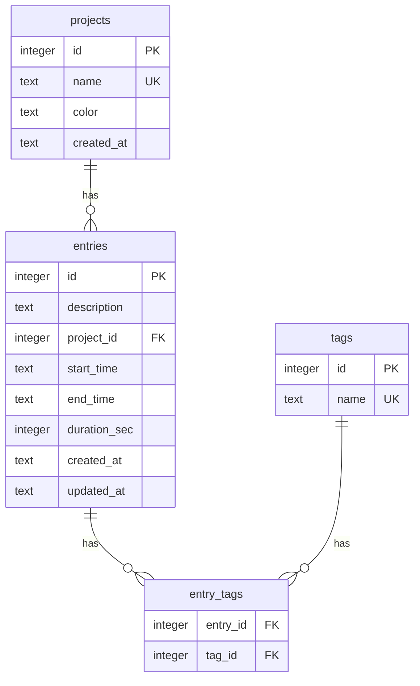

# CLI タイマーアプリ 開発プラン

## 1. プロジェクト概要

Toggl のような時間計測・管理機能を CLI で実行できるアプリケーション。
タスクごとの作業時間を記録・集計し、プロジェクト単位でのレポートを生成する。

### コンセプト

- **シンプル**: `trc start "タスク名"` で即座に計測開始
- **高速**: CLI ネイティブで起動が速い
- **見やすい**: ターミナルに最適化された表示

---

## 2. 技術スタック

| 項目 | 選定 | 理由 |
|------|------|------|
| 言語 | TypeScript (Node.js) | CLI エコシステムが充実、型安全 |
| CLI フレームワーク | Commander.js | 軽量で実績豊富 |
| ターミナル装飾 | chalk + cli-table3 | 色付き出力・テーブル表示 |
| データ保存 | SQLite (better-sqlite3) | 軽量でローカル完結、SQL で集計が容易 |
| 日時処理 | dayjs | 軽量な日時ライブラリ |
| ビルド | tsup | 高速バンドラー |
| テスト | Vitest | 高速・TypeScript ネイティブ |
| パッケージ管理 | npm | 標準的 |

---

## 3. 機能一覧

### 3.1 コア機能（Must）

| # | 機能 | コマンド例 | 説明 |
|---|------|-----------|------|
| F1 | タイマー開始 | `trc start "レビュー作業"` | 新しいタイマーを開始 |
| F2 | タイマー停止 | `trc stop` | 実行中のタイマーを停止 |
| F3 | ステータス確認 | `trc status` | 現在のタイマー状態と経過時間を表示 |
| F4 | タイマー一覧 | `trc list` | 今日の記録を一覧表示 |
| F5 | レポート表示 | `trc report` | 日/週単位の集計レポート |
| F6 | プロジェクト指定 | `trc start -p myproject "タスク"` | プロジェクトに紐づけて記録 |

### 3.2 便利機能（Should）

| # | 機能 | コマンド例 | 説明 |
|---|------|-----------|------|
| F7 | 直前の再開 | `trc continue` | 直前のタイマーと同じ内容で再開 |
| F8 | エントリ削除 | `trc delete <id>` | 記録を削除 |
| F9 | エントリ編集 | `trc edit <id> --desc "新しい説明"` | 記録を修正 |
| F10 | タグ付け | `trc start -t bug,frontend "修正"` | タグで分類 |
| F11 | プロジェクト管理 | `trc project list` | プロジェクトの CRUD |
| F12 | エクスポート | `trc export --format csv` | CSV/YAML で出力 |

### 3.3 拡張機能（Could）

| # | 機能 | コマンド例 | 説明 |
|---|------|-----------|------|
| F13 | ポモドーロモード | `trc pomodoro` | 25分作業 + 5分休憩のサイクル |
| F14 | 目標設定 | `trc goal set --daily 8h` | 日次目標時間の設定・達成率表示 |
| F15 | インタラクティブUI | `trc ui` | TUI でリアルタイム表示 |

---

## 4. コマンド体系

```
trc <command> [options]

Commands:
  start [description]     タイマーを開始する
  stop                    実行中のタイマーを停止する
  status                  現在のタイマー状態を表示する
  list [--date YYYY-MM-DD] [--project <name>]
                          記録を一覧表示する
  report [--period day|week|month] [--project <name>]
                          集計レポートを表示する
  continue                直前のタイマーを再開する
  delete <id>             記録を削除する
  edit <id> [options]     記録を編集する
  project <subcommand>    プロジェクト管理
  export [--format csv|yaml]
                          データをエクスポートする

Global Options:
  -p, --project <name>    プロジェクトを指定
  -t, --tags <tags>       タグをカンマ区切りで指定
  -h, --help              ヘルプを表示
  -v, --version           バージョンを表示
```

---

## 5. データモデル

### 5.1 ER 図



### 5.2 テーブル定義

```sql
CREATE TABLE projects (
    id INTEGER PRIMARY KEY AUTOINCREMENT,
    name TEXT NOT NULL UNIQUE,
    color TEXT DEFAULT '#3498db',
    created_at TEXT DEFAULT (datetime('now'))
);

CREATE TABLE entries (
    id INTEGER PRIMARY KEY AUTOINCREMENT,
    description TEXT NOT NULL DEFAULT '',
    project_id INTEGER REFERENCES projects(id),
    start_time TEXT NOT NULL,
    end_time TEXT,
    duration_sec INTEGER,
    created_at TEXT DEFAULT (datetime('now')),
    updated_at TEXT DEFAULT (datetime('now'))
);

CREATE TABLE tags (
    id INTEGER PRIMARY KEY AUTOINCREMENT,
    name TEXT NOT NULL UNIQUE
);

CREATE TABLE entry_tags (
    entry_id INTEGER REFERENCES entries(id) ON DELETE CASCADE,
    tag_id INTEGER REFERENCES tags(id) ON DELETE CASCADE,
    PRIMARY KEY (entry_id, tag_id)
);
```

---

## 6. ディレクトリ構成

```
cli-tracker/
├── package.json
├── tsconfig.json
├── tsup.config.ts          # ビルド設定
├── vitest.config.ts         # テスト設定
├── src/
│   ├── index.ts             # エントリーポイント（CLI 定義）
│   ├── commands/            # コマンドハンドラー
│   │   ├── start.ts
│   │   ├── stop.ts
│   │   ├── status.ts
│   │   ├── list.ts
│   │   ├── report.ts
│   │   ├── continue.ts
│   │   ├── delete.ts
│   │   ├── edit.ts
│   │   ├── project.ts
│   │   └── export.ts
│   ├── db/                  # データベース層
│   │   ├── connection.ts    # DB 接続・初期化
│   │   ├── migrations.ts    # マイグレーション
│   │   └── repositories/    # リポジトリパターン
│   │       ├── entry.ts
│   │       ├── project.ts
│   │       └── tag.ts
│   ├── services/            # ビジネスロジック
│   │   ├── timer.ts         # タイマー操作
│   │   ├── report.ts        # レポート集計
│   │   └── export.ts        # エクスポート処理
│   ├── ui/                  # 表示ロジック
│   │   ├── formatter.ts     # 時間フォーマット
│   │   ├── table.ts         # テーブル表示
│   │   └── colors.ts        # 色定義
│   └── utils/               # ユーティリティ
│       ├── config.ts        # 設定管理（DBパス等）
│       └── time.ts          # 時間計算ヘルパー
├── tests/
│   ├── commands/
│   ├── services/
│   └── db/
└── README.md
```

---

## 7. 出力イメージ

### `trc status`

```
⏱  Running: レビュー作業
   Project: myproject
   Started: 14:30:00
   Elapsed: 1h 23m 45s
```

### `trc list`

```
Today's Entries (2026-03-02)
┌────┬──────────┬──────────┬───────────┬──────────┬──────────┐
│ ID │ Project  │ Desc     │ Start     │ End      │ Duration │
├────┼──────────┼──────────┼───────────┼──────────┼──────────┤
│  1 │ backend  │ API実装   │ 09:00     │ 11:30    │ 2h 30m   │
│  2 │ frontend │ UI修正    │ 13:00     │ 14:15    │ 1h 15m   │
│  3 │ backend  │ レビュー  │ 14:30     │ running  │ 1h 23m   │
├────┼──────────┼──────────┼───────────┼──────────┼──────────┤
│    │          │          │           │ Total    │ 5h 08m   │
└────┴──────────┴──────────┴───────────┴──────────┴──────────┘
```

### `trc report --period week`

```
Weekly Report (2026-02-23 ~ 2026-03-01)
Total: 38h 45m

By Project:
  backend   ████████████████░░░░  22h 30m (58%)
  frontend  ████████░░░░░░░░░░░░  12h 15m (32%)
  docs      ████░░░░░░░░░░░░░░░░   4h 00m (10%)

By Day:
  Mon  ████████  8h 15m
  Tue  ███████░  7h 30m
  Wed  ████████  8h 00m
  Thu  ███████░  7h 45m
  Fri  ███████░  7h 15m
  Sat  ░░░░░░░░  0h 00m
  Sun  ░░░░░░░░  0h 00m
```

---

## 8. 実装フェーズ

### Phase 1: 基盤構築（コア機能）

1. プロジェクト初期化（package.json, tsconfig, ビルド設定）
2. DB 接続・テーブル作成
3. `start` / `stop` / `status` コマンド実装
4. 基本的な表示フォーマット
5. 単体テスト作成

### Phase 2: 一覧・レポート機能

1. `list` コマンド（テーブル表示）
2. `report` コマンド（日/週/月の集計）
3. プロジェクト指定オプション（`-p`）
4. テスト追加

### Phase 3: 便利機能

1. `continue` コマンド
2. `delete` / `edit` コマンド
3. タグ機能（`-t`）
4. `project` サブコマンド
5. `export` コマンド（CSV/YAML）

### Phase 4: 品質向上

1. エラーハンドリングの強化
2. ヘルプメッセージの充実
3. npm パッケージとしての公開設定（`bin` フィールド）
4. E2E テスト
5. README 作成

---

## 9. 開発コマンド

```bash
# セットアップ
cd cli-tracker
npm install

# 開発
npm run dev -- start "テスト"    # ts-node で直接実行

# ビルド
npm run build                    # tsup でバンドル

# テスト
npm test                         # Vitest 実行
npm run test:coverage            # カバレッジ付き

# リント
npm run lint                     # ESLint
npm run format                   # Prettier

# ローカルインストール
npm run build                    # 先にビルド
npm link                         # グローバルに `trc` コマンドを登録

# PATH 設定（npm global bin が PATH に含まれていない場合）
echo 'export PATH="$PATH:$(npm prefix -g)/bin"' >> ~/.bashrc
source ~/.bashrc
```

---

## 10. 非機能要件

| 項目 | 要件 |
|------|------|
| 起動速度 | 200ms 以内にコマンド実行完了 |
| データ容量 | 1年分の記録（約10万エントリ）でも快適動作 |
| 対応 OS | macOS, Linux, Windows |
| Node.js | v18 以上 |
| データ保存先 | `~/.cli-tracker/data.db`（XDG_DATA_HOME 対応） |
| オフライン | 完全ローカル動作、ネットワーク不要 |
